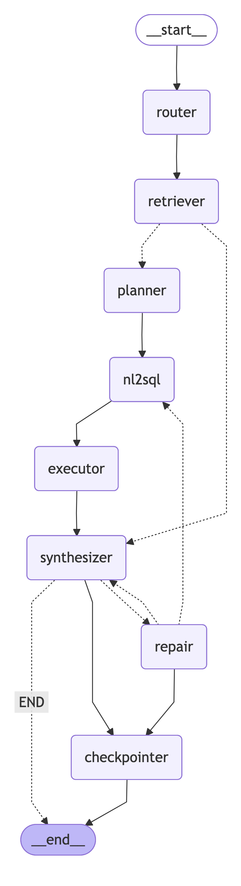

### The Graph structure

### Steps to execute the code:

1. create virtual environment ( used uv)
`uv venv .venv`

2. Activate the environment
`source .venv/bin/activate`

3. Install all the dependencies
`uv add -r requirements.txt`

4. Run the code
`python run_agent_hybrid.py --batch sample_questions_hybrid_eval.jsonl --out outputs_hybrid.jsonl `

### DSPy Optimization

- Optimization is performed on Router module using MIPROv2
- code is placed in [See function in dspy_classifier_optimization.py](./dspy_classifier_optimization.py) file
- Optimized from 33% to 75%

